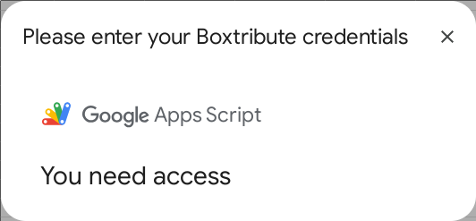

# Trouble-shooting

## I see the message "You need access"

This is a classic and very common issue in the Google Apps Script environment.

The "You need access" error almost always means **the user is logged into multiple Google accounts in the same browser.**

### How to Fix It (For Testing and Users)

Select one of the following:

* **Solution 1 (The Quick Test):** Run your add-on in an **Incognito Window**. In Incognito, log in *only* to the single Google account that has the spreadsheet. This guarantees there is no account conflict.
* **Solution 2 (The Best Fix):** Use **Chrome Profiles**. Create a separate Chrome Profile for each Google account. This keeps all cookies, logins, and sessions completely separate.
* **Solution 3 (The Annoying Fix):** **Log out of all Google accounts** in your browser. Then, log back in *only* with the account you are using for the spreadsheet.

  
Why This Happens (click for technical explanation):

1.  **Modal is an `iframe`**: The `showModalDialog` command creates a modal window, which is essentially an `iframe` that loads your HTML.
2.  **Server vs. Client**: Your server-side code (`.gs`) runs `showModalDialog`, which successfully creates the modal and sets its **title** ("My Dialog"). This part works fine because it's running as the user who ran the add-on.
3.  **Client-Side Loading**: The browser then tries to load the *content* of that `iframe` (your HTML file). To do this, it has to fetch the HTML from Google's servers (`n-....googleusercontent.com`).
4.  **Multi-Account Conflict**: If you are logged into multiple Google accounts (e.g., `personal@gmail.com` and `work@company.com`), your browser often defaults to your *primary* account (the first one you logged into) for new authentication requests.
5.  **The Error**: The browser tries to fetch the HTML using your `personal@gmail.com` account, but the add-on is running under your `work@company.com` account. Google's servers see the request from the wrong user, deny access, and serve the "You need access" error page inside the `iframe`.

